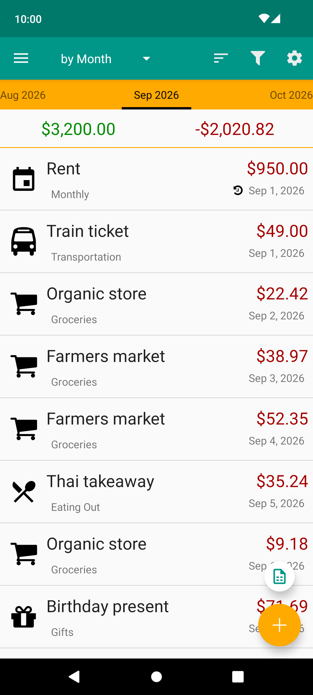
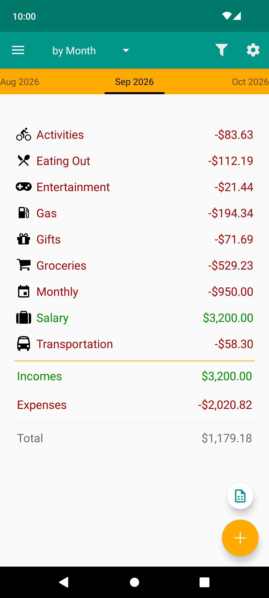
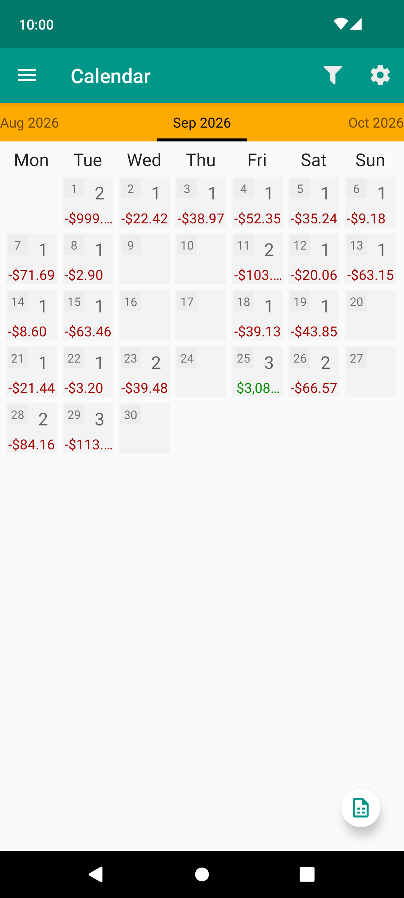
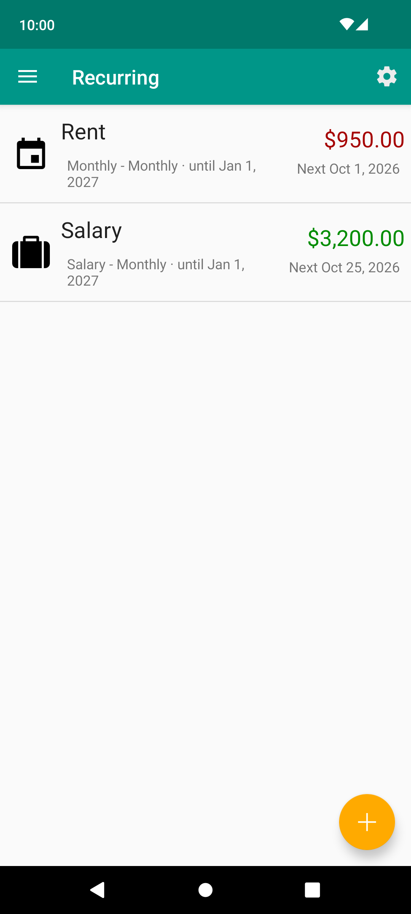

# Expense Log 2.0

**The continuation of the beloved Android App Expense Log** 

The original app is no longer maintained; this one picks up where it left off. Your records come with you.

  
  
  
  

## Features

- Expenses and income by category, with icons, and across multiple accounts
- Records by day, week, month, year or all time, as a list, calendar, summary or graph
- Recurring entries, daily to yearly; edit only one entry, this and following, or the whole series
- Select several records and delete them, with Undo
- Filter and sort records
- Budget tracking for a period
- Daily reminder to log your spending
- CSV export for any period
- `.edb` database export and import, plus automatic local backups
- Optional Dropbox backup and sync between devices
- Runs on Android 8.0 and newer, up to Android 16
- Private and offline

## Bring your data over

Expense Log reads the original app's databases as they are. The database format is unchanged, so
an `.edb` file from the original app imports with all its records, categories, accounts and
recurring entries.

1. In the original app, export your database (`.edb`).
2. Install Expense Log. It is a separate app (`de.timowa.expenselog`) and installs next to the
   original, so you can keep the old one until you are happy.
3. In Expense Log, go to **Settings → Data & sync → Import Database** and choose the file.

## Building

See [BUILDING.md](BUILDING.md).

---

This project is published and maintained by me. It is not affiliated with AR Productions
or Andrew, who handed over the original source code under the Apache License 2.0 and is
otherwise not involved. Provided as-is, without warranty; see [LICENSE](LICENSE) and
[NOTICE](NOTICE).
